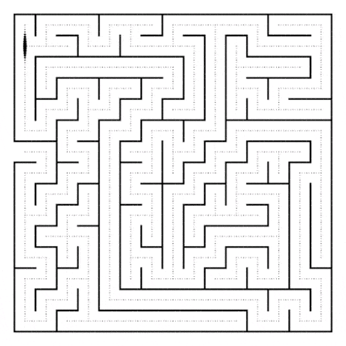
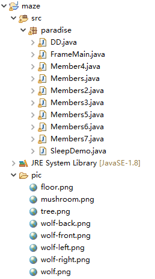
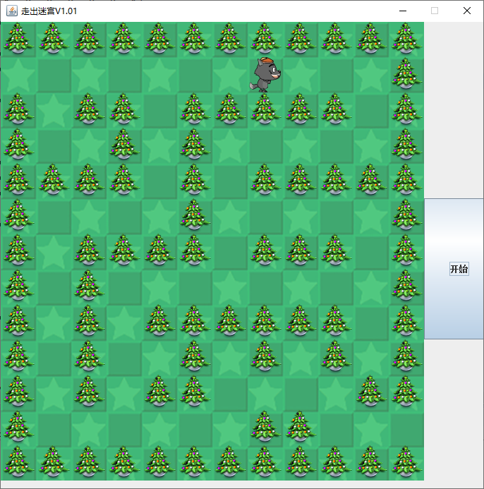

这是一个自动走出迷宫的java实现代码。
### 背景
我是在大一暑假的时候，转专业，想表现一下。
当时看了一点java的书，自以为会写一些小程序了。
然后，一天无聊刷微博的时候看到这样一张图。



当时觉得挺有意思的，就想为什么不自己做一个自动走出迷宫的程序呢。
仔细看，那个小点是走不出迷宫的，有个小细节。最后那个迷宫位置自己改变了。

### 原理
迷宫圈子里流传了这样一种说法，说只要你一直靠右（左）走，你就能走出迷宫。但不适合回形迷宫，以及更加复杂的迷宫。
当时连算法都不懂，直接暴力求解，用了40多个```if判断句```。 

OS：后面才知道这样的走法叫做DFS，深度优先遍历。 

<p align="center">
  
</p>   

### 实现
见```maze```文件夹，下载zip解压以后导入```eclipse```的```workspace```中，比如我导入的路径是```C:\Users\mm\eclipse-workspace```。  
  
在eclipse中的树形图，```Members7.java```是最后的运行版本。
小更新：```Members8.java```是DFS实现的运行版本。

### 缺点
由于后来更新了笔记本系统，好多文件都找不到了。而且现在不在用java，背景图片也不见了。
所以不能直接fork，只能算是留给自己的小小纪念吧。

### 更新
这个项目我在更换前的硬盘中找到了，算是让这件事圆满了。

### 运行截图

